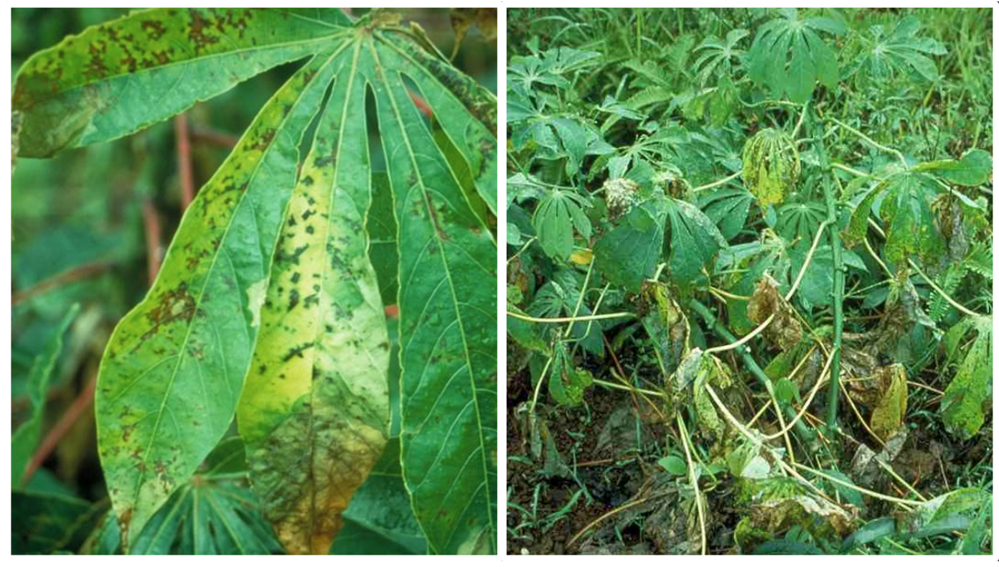
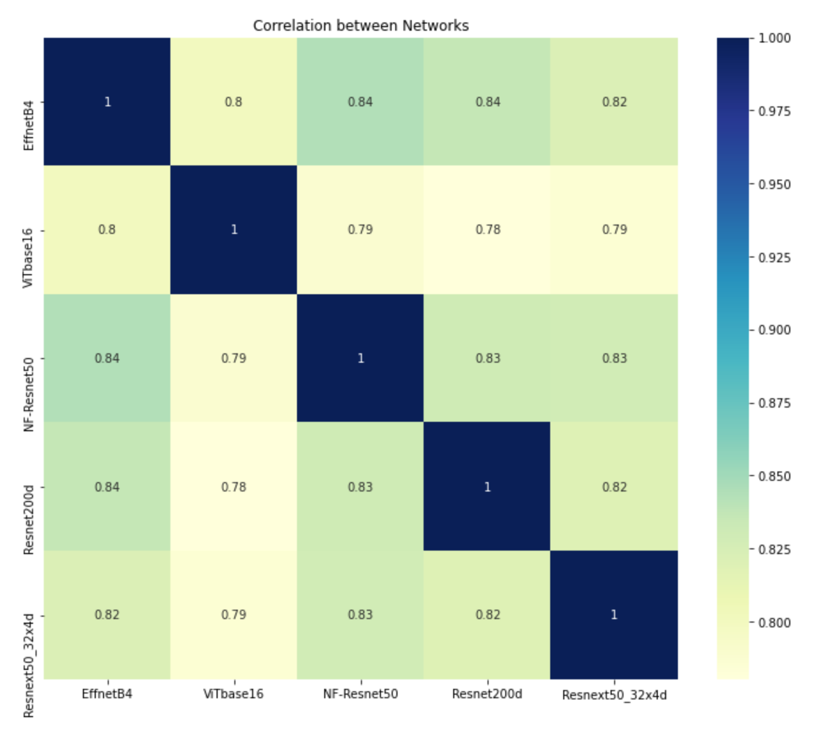

# cassavana_kaggle

### Introduction
**Cassava Leaf Disease Classification** is a kaggle competition where kagglers are task to classify each cassava image into four disease categories or a fifth category indicating a healthy leaf.
#### Motivation
Cassava is the second-largest provider of carbohydrates in Africa, a key food security crop grown by smallholder farmers. 80% of household farms in Sub-Saharan Africa grow this starchy root, but viral diseases are major sources of poor yields. By leveraging on vision models, farmers can quickly identify diseased plants, potentially saving their crops before they inflict irreparable damage.



<br>

### TLDR;
My solution is a weighted ensemble of 4 models: **EfficientNetB4**, **Vit_base16**, **Resnet200d** and **NF-Resnet50**. The models are trained on either with or without external data, with the images augmented in the form of Cutmix and Fmix alongside some basic albumentation augmentations. Inference was done with x4 TTA.
#### Ranking
149/3947 (Silver)

### Dataset
I would like to thank [@tahsin](https://www.kaggle.com/tahsin) for sharing with the community the merged 2019/2020 dataset. I used the merged data for training my NFNet. I did a stratified KFold only on the 2020 data source, and combine the 2019 data with the training folds to ensure that the 2019 data does not seep into my validation fold, which may affect my CV if there is a shift in input distribution between 2019 and 2020 data.

### Models
The models i experimented with (5 folds):
* EfficientNet B4 (512 x 512)
* Vit base16 (384 x 384)
* Resnet200d (512 x 512)
* NF-Resnet50 (512 x 512)
* Resnext50_32x4d (512 x 512)

I first got to know about [VisionTransformers](https://arxiv.org/pdf/2010.11929.pdf) from this competition and i was immediately intrigued by its architecture; to solve vision tasks without convolution layers was just mind blowing to me! I would like to thank [@mobassir](https://www.kaggle.com/mobassir) for introducing the [NFNet](https://arxiv.org/abs/2102.06171), which has quite a decent performance on my local CV. At the time of competing, timm package only has a few pre-trained weights available for transfer learning, and i used NF-Resnet50 (Thank you [@rwightman](https://www.kaggle.com/rwightman))! 

#### Model Correlation



Combining models with different strengths will usually give the best synergies. Thus, i used this correlation matrix to experiment my way into ensembles. I find it interesting that the **ViT model has the least correlation with all other models**. Maybe because of the different underlying operation that creates the receptive field of the image (Convolution vs Attention) ??


#### Ensemble
EfficientNet B4 and NF-Resnet perform the strongest on my local CV without any TTA. However earlier on i was using EfficientNet B4 as a starting baseline since i only knew about NFNets few days before the deadline, and start building my ensemble from there. I cant seem to find any correlation between CV/Public/Private. Im eager to see what are some of the robust strategies that were used.

| Models | CV | Public LB | Private LB|
|---|---|---|---|
|EffNet|0.897|0.900|0.898|
|ViT|0.896|0.898|0.896|
|NFNet* (no TTA)|0.896|-|-|
|Resnet|0.895|-|-|
|EffNet + ViT|0.898|0.903|0.900|
|EffNet + ViT + Resnet + NFNet*|0.901|0.904|0.899|
|EffNet + ViT + Resnet + NFNet* + Resnext (No TTA)|0.901|0.902|0.897|

*denotes the use of external data (2019 dataset). All results are based on x4 TTA unless stated otherwise.

#### Final Submission
The final model i used for submission consist of a weighted ensemble of 4 models, as shown in the 3rd row, with x4 TTA. The funny thing is that a simple average of Effnet with ViT (2nd row) gives a better private LB score.


All inferences are done with x4 TTA as follows:
```
return Compose([
            RandomResizedCrop(CFG.size[CFG.model], CFG.size[CFG.model]), 
            HorizontalFlip(p=0.5), 
            VerticalFlip(p=0.5),
            Transpose(p=0.5),
            Normalize(
                mean=[0.485, 0.456, 0.406], 
                std=[0.229, 0.224, 0.225], 
                max_pixel_value=255.0, p=1.0),
            ToTensorV2(p=1.0),
        ])
```

### Training Settings
* Validation: Stratified, 5 folds
* Optimizer: Adam
* Loss: LabelSmoothLoss (smooth=0.3)
* Scheduler: CosineWarmRestarts
* Augmentation: Cutmix + Fmix (25% prob each, independently) with Albumentation
* Epoch: 15

<br>

#### Stuff that does not work (for me)
* [Stochastic Weight Averaging (SWA)](https://arxiv.org/pdf/1803.05407.pdf): The idea of averaging the model weights along the weight space appeals to me, however, i couldn't get it to work.
* Large Models: I only experimented with B5 and ViT large 16. Both models does not improve from my smaller variants.

#### Stuff I didn't try (possible future work)
* Snapmix
* Knowledge Distillation
* Pseudo-Labeling
* Meta-classifier on top of base models

### Possible Improvements
1. This is the first time i build a pipeline for experimenting. Although i generate loggings in my experiment, i did not save it as i never found a use for it initially. On hindsight, saving each logs would be so useful so that i can trace my experiments and progress, avoiding any repetitive experiments that does not add value.
